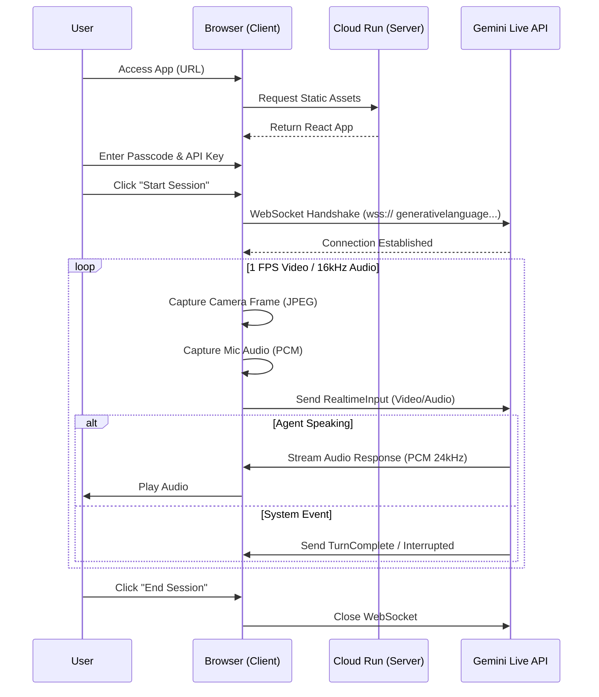

# Go-live — Gemini Live Router Assistant

**Go-live** is your real-time AI pocket handyman. Say “Hey Go-live” and point your phone camera at the issue—router, breaker panel, privacy lock, garage door, squeaky hinge, or similar basic home problem.


## 🚀 Live Demo for Judges

**Access the live application here:**
👉 **[https://go-live-3une346tzq-uc.a.run.app](https://go-live-3une346tzq-uc.a.run.app)**

---

## 🔐 Access Instructions

To test the application, you will need to bypass the security gate:

1.  **System Access:** `golive` 
2.  **Gemini API Key:** You will be prompted to enter your own Google Gemini API Key.
    *   *Need a key? Get one here: [Google AI Studio](https://aistudio.google.com/app/apikey)*

---

## 🧪 How to Test

1.  **Open the App**: Navigate to the URL above on your mobile device (recommended) or desktop with a webcam.
2.  **Enter Passcode**: Type `golive` to unlock the interface.
3.  **Enter API Key**: Provide your Gemini API key when prompted.
4.  **Start Session**:
    *   Click the **"Start Live Session"** button.
    *   Allow **Microphone** and **Camera** permissions when asked.
5.  **Follow the Agent**:
    *   The AI agent (Voice: "Zephyr") will greet you and ask to see the front of your router.
    *   **Step 1:** Point your camera at a router (or an image of one). The agent is looking for LED status lights.
    *   **Step 2:** The agent will ask to see the back ports. Point the camera at the WAN/Internet port.
    *   **Step 3:** Simulating a fix (e.g., "reseat the cable"), the agent will confirm when the connection is restored.

---

## 🛠️ Local Development

If you prefer to run the project locally:

### Prerequisites
- Node.js 18+
- Docker (optional)

### Using Docker (Recommended)
```bash
# Build the image
docker build -t go-live .

# Run the container
docker run -p 8080:8080 go-live
```
Access at: `http://localhost:8080`

### Using npm/pnpm
```bash
# Install dependencies
pnpm install

# Start development server
pnpm dev
```

---

## 🏗️ Technology Stack

-   **Frontend**: React, Vite, TailwindCSS
-   **AI Model**: Google Gemini 2.0 Flash (Native Audio/Video streaming)
-   **SDK**: Google GenAI SDK (`@google/genai`)
-   **Infrastructure**: Google Cloud Run, Cloud Build
-   **Real-time Interaction**: WebSocket-based audio/video streaming

---

## 📐 Architecture

```mermaid
graph TD
    subgraph "User Environment"
        Browser[User Browser <br/>(React Application)]
        Microphone
        Camera
        LocalStorage[(Local Storage <br/> API Key)]
    end

    subgraph "Google Cloud Platform"
        CloudRun[Cloud Run Service <br/> (Node.js/Express)]
    end

    subgraph "Google AI Services"
        GeminiAPI[Google Gemini Live API]
        GeminiModel[Gemini 2.0 Flash]
    end

    Browser -->|1. Load App| CloudRun
    CloudRun -->|2. Serve Static Assets| Browser
    
    Browser -->|3. Retrieve stored API Key| LocalStorage
    Browser -->|4. Establish WebSocket| GeminiAPI
    
    Microphone -->|Capture PCM Audio (16kHz)| Browser
    Camera -->|Capture Video Frames (JPEG)| Browser
    
    Browser -->|5. Stream Audio/Video| GeminiAPI
    GeminiAPI -.->|Process Multimodal Input| GeminiModel
    GeminiAPI -->|6. Stream Audio Response (24kHz)| Browser
```

### 🔄 Interaction Flow


